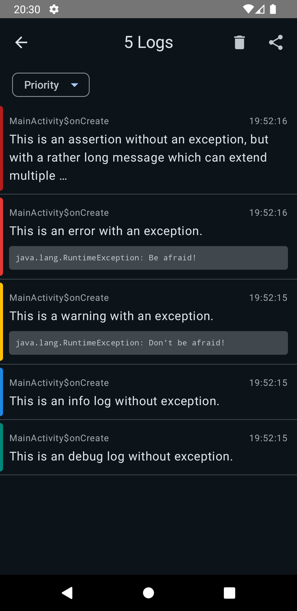

# Shed

[](https://central.sonatype.com/artifact/io.github.janmalch/ktor-revfile-core)

_Putting [Timber](https://github.com/JakeWharton/timber) into a [Room](https://developer.android.com/training/data-storage/room)._

## About

Shed persists your `Timber` logs in a database, and provides an Activity to [view](#screenshots) and export them.

Use it for hobby projects or internal apps, without access to a proper remote logging system.
You most likely don't want to use it in a real production app.

## Installation

Shed provides two modules: `shed` and `shed-nop`.
`shed-nop` has the same API surface as `shed`, but its implementations do nothing at runtime.

```kotlin
dependencies {
    val shed_version = "?"
    implementation("com.jakewharton.timber:timber:5.0.1")

    // Only use database in debug builds, do nothing in release builds.
    debugImplementation("io.github.janmalch.shed:shed:$shed_version")
    releaseImplementation("io.github.janmalch.shed:shed-nop:$shed_version")
}
```

You can then create and plant a tree, just like any other `Timber.Tree`.

```kotlin
class ShedDemoApp : Application() {
    override fun onCreate() {
        super.onCreate()
        if (BuildConfig.DEBUG) {
            Timber.plant(Timber.DebugTree())
            // When using "shed-nop", this factory returns a no-op tree.
            Timber.plant(Shed.createTree(context = this))
        }
    }
}
```

The `Shed.createTree` factory also provides optional clean-up parameters,
so that the database doesn't grow forever.
Please refer to its documentation for more info.

To view and export the logs, you can simply navigate to the dedicated activity
with the static [`Shed.startActivity` function](./shed/src/main/java/com/github/janmalch/shed/Shed.kt#L50).
For `shed-nop`, this will be a [no-op call](./shed-nop/src/main/java/com/github/janmalch/shed/Shed.kt#L45).

```kotlin
Button(
    onClick = { Shed.startActivity(context) }
) {
    Text("View Logs")
}
```

See the [demo app](./app/src/main/java/com/example/app) for a full setup.

## Screenshots


